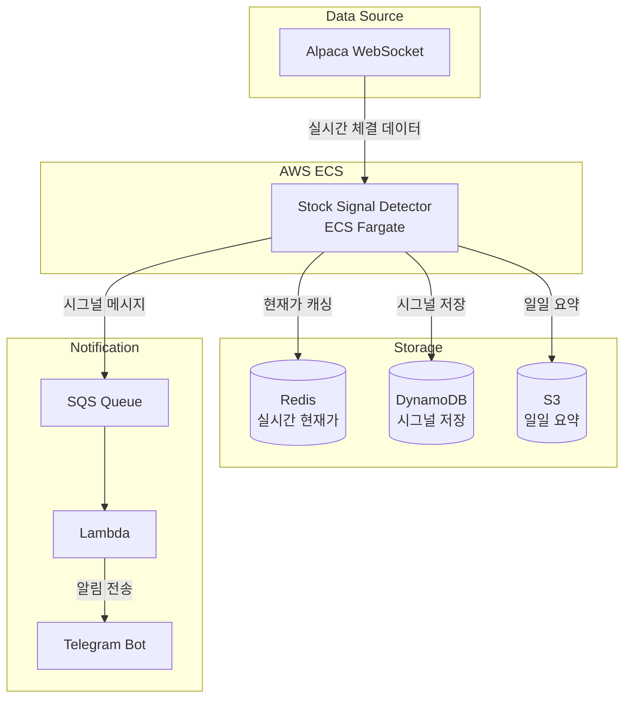

# Stock Signal Detector

S&P 500 종목의 실시간 가격 변동을 모니터링하고, 급등(Bounce) 및 급락(Crash) 시그널을 감지하여 알림을 전송하는 서비스입니다.

## 📢 소스 코드 비공개 안내

**본 프로젝트는 현재 실제 상용 서비스 출시를 위한 비즈니스 모델 검증 및 고도화 단계에 있어, 핵심 비즈니스 로직 보호를 위해 소스 코드는 비공개(Private)로 관리되고 있습니다.**

소스 코드를 직접 확인하실 수 없는 대신, 본 문서에는 **시스템 아키텍처, 기술적 의사결정(Architecture Decision), 트러블 슈팅** 과정을 상세히 기술하여 백엔드/데이터 엔지니어링 역량을 파악하실 수 있도록 구성하였습니다.

> *구체적인 구현 로직이나 운영 방식에 대한 질문은 인터뷰 시 상세히 답변드리겠습니다.*

## 주요 기능

- **실시간 모니터링**: Alpaca WebSocket을 통한 S&P 500 전 종목 실시간 가격 수신
- **5분봉 집계**: Trade 데이터를 5분 단위 OHLCV 바로 집계
- **시그널 감지**: 전일 종가 대비 지정된 임계값(±5%, ±10%, ±15% 등) 초과 시 시그널 발생
- **알림 전송**: SQS → Lambda → Telegram 파이프라인을 통한 실시간 알림
- **데이터 저장**: DynamoDB(시그널), Redis(실시간 현재가), S3(일일 요약)

## 개발 현황

| 기능 | 상태 | 비고 |
|------|------|------|
| 실시간 모니터링 | ✅ 완료 | |
| 시그널 감지 | ✅ 완료 | |
| Telegram 알림 | ✅ 완료 | |
| S3 저장 | ✅ 완료 | |
| DynamoDB 저장 | 🚧 개발중 | 웹페이지 연동 예정 |
| Redis 캐싱 | 🚧 개발중 | 웹페이지 연동 예정 |
| 웹페이지 | 🚧 개발중 | 실시간 대시보드 |

## 아키텍처



## 💡 기술적 의사결정 (Architecture Decisions)

| 기술 | 선택 이유 |
|------|-----------|
| **Redis** | 실시간 대시보드(Polling)를 위해 1초 미만의 빠른 읽기 속도가 필요하여 인메모리 캐시 도입 |
| **DynamoDB** | 시그널 발생 이력은 쓰기 빈도는 낮지만 장기 보관 및 시계열 조회가 필요하여 Serverless DB 선택 |
| **ECS Fargate** | WebSocket 연결을 지속(Stateful)해야 하므로 Lambda 대신 컨테이너 기반 서비스 선택 |

## 설정

### 환경변수

| 변수명 | 필수 | 설명 |
|--------|------|------|
| `CONFIG_S3_BUCKET` | ✅ | 설정 파일이 저장된 S3 버킷명 |

### S3 설정 파일

모든 설정은 S3 버킷의 `config/` 디렉토리에서 관리됩니다.

```
s3://{CONFIG_S3_BUCKET}/
├── config/
│   ├── app_config.json        # 애플리케이션 설정
│   ├── alpaca_api_key.json    # Alpaca API 키
│   ├── polygon_api_key.json   # Polygon API 키
│   └── telegram_config.json   # Telegram 설정
├── sp500-metadata/{date}/     # 종목 메타데이터
├── sp500-prices/{date}/       # 전일 종가 데이터
├── signal-detect-result/{date}/ # 시그널 결과
└── daily-ticker-summary/      # 일일 요약
```

#### app_config.json

```json
{
    "SQS_QUEUE_URL": "https://sqs.{region}.amazonaws.com/{account-id}/{queue-name}",
    "redis_host": "{your-redis-endpoint}.cache.amazonaws.com",
    "redis_port": 6379,
    "dynamodb_table_name": "stock_price",
    "dynamodb_region": "ap-northeast-2"
}
```

#### alpaca_api_key.json

```json
{
    "alpaca_key_id": "{YOUR_ALPACA_KEY_ID}",
    "alpaca_secret_key": "{YOUR_ALPACA_SECRET_KEY}"
}
```

## 배포

### ECS Task Definition

`taskdef.json`의 `containerDefinitions.environment`에 환경변수 추가:

```json
"environment": [
    {
        "name": "PYTHONUNBUFFERED",
        "value": "1"
    },
    {
        "name": "CONFIG_S3_BUCKET",
        "value": "{your-s3-bucket-name}"
    }
]
```

### IAM 권한

ECS Task Role에 필요한 권한:

- **S3**: `s3:GetObject`, `s3:PutObject` (설정 버킷)
- **DynamoDB**: `dynamodb:PutItem` (stock_price 테이블)
- **SQS**: `sqs:SendMessage` (알림 큐)
- **ElastiCache**: Redis 접근 (VPC 내)

## 시그널 임계값

| 타입 | 임계값 |
|------|--------|
| Bounce (급등) | +5%, +10%, +15%, +20%, +25%, +30%, +50% |
| Crash (급락) | -5%, -10%, -15%, -20%, -25%, -30%, -50% |

동일 종목에서 여러 임계값이 동시에 트리거되면 가장 큰 값만 알림 발송 (중복 방지)

## 로컬 실행

```bash
# 환경변수 설정
export CONFIG_S3_BUCKET={your-s3-bucket-name}

# AWS 자격증명 설정 (로컬 테스트 시)
export AWS_PROFILE={your-profile}

# 실행
python main.py
```

## 출력 데이터

### DynamoDB (stock_price 테이블)

| 필드 | 타입 | 설명 |
|------|------|------|
| symbol (PK) | String | 종목 심볼 |
| timestamp (SK) | String | ISO 8601 타임스탬프 |
| trading_date | String | 거래일 (YYYY-MM-DD) |
| current_price | Number | 현재가 |
| t1_close | Number | 전일 종가 |
| change_percentage | Number | 변동률 (%) |
| threshold | Number | 트리거된 임계값 (%) |
| signal_type | String | "bounce" 또는 "crash" |

### Redis

```
stock:{symbol}
├── price: 현재가
├── change_pct: 변동률 (%)
└── updated_at: 업데이트 시간 (ISO 8601)
```

## Health Check

ECS 헬스체크를 위해 `/tmp/heartbeat` 파일을 주기적으로 업데이트합니다.

```bash
# 헬스체크 명령어 (taskdef.json)
CMD-SHELL, test -f /tmp/heartbeat && find /tmp/heartbeat -mmin -10 | grep -q .
```

## 종료 코드

| 코드 | 설명 |
|------|------|
| 0 | 정상 종료 |
| 1 | 에러 발생 |
| 2 | 마켓 휴장일 (주말/공휴일) |
| 130 | 사용자 인터럽트 (Ctrl+C) |

## 로그 예시

```
2025-01-15 14:30:00 UTC - INFO - ================================================================================
2025-01-15 14:30:00 UTC - INFO - 🚨🚨🚨 SIGNAL DETECTED 🚨🚨🚨
2025-01-15 14:30:00 UTC - INFO - Symbol: NVDA (NVIDIA Corporation)
2025-01-15 14:30:00 UTC - INFO - Sector: Information Technology
2025-01-15 14:30:00 UTC - INFO - Change: -10.25% (Threshold: -10%)
2025-01-15 14:30:00 UTC - INFO - Price: $142.50 → $127.89
2025-01-15 14:30:00 UTC - INFO - ================================================================================
```